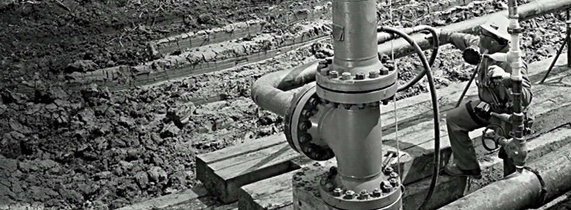

.. _Edmonton1:

+-------------------------+-------------------------+-------------------------+-------------------------+
|.. _figa:                |                         |                         |.. _figb:                |
|                         |                         |                         |                         |
|.. figure:: UofAlogo.jpg |.. figure:: YPACLogo.JPG |.. figure:: UofAlogo.jpg |.. figure:: YPACLogo.JPG |
|   :width: 80 %          |   :width: 80 %          |   :width: 80 %          |   :width: 80 %          |
|   :align: center        |   :align: center        |   :align: center        |   :align: center        |
|                         |                         |                         |                         |
+-------------------------+-------------------------+-------------------------+-------------------------+

Membership
==================
There are currently no fees associated with membership. U of A YPAC treats all personal information provided by members in accordance with Alberta's Personal Information Protection act.

Eligibility
--------------------
In order to become a member of U of A YPAC, you should meet the following criteria:

- Be a current undergraduate or graduate student in the University of Alberta who is working on a pipeline project or interested in the pipeline studies.
- Or be a recent graduate student with a reasonable chance of entering the pipeline industry.